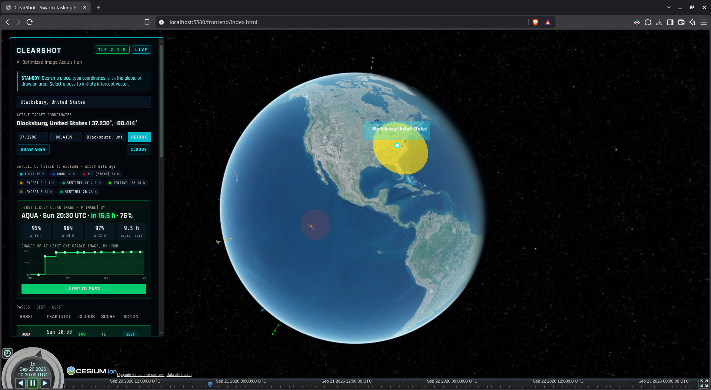
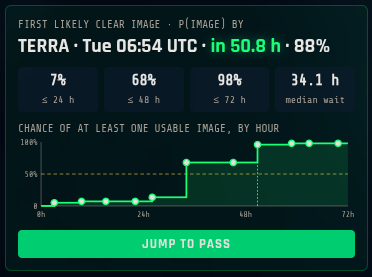
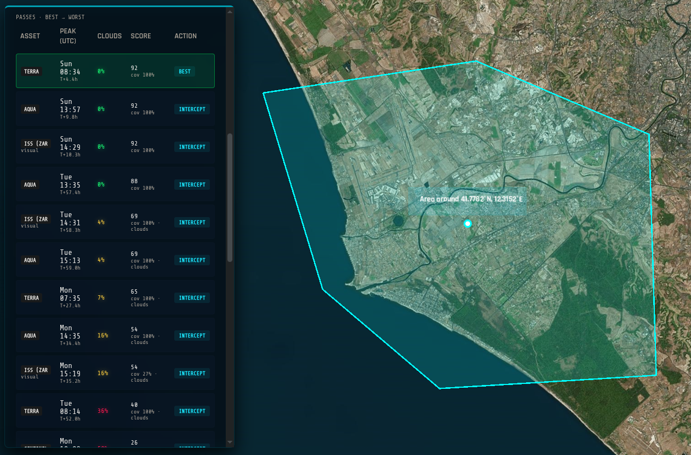
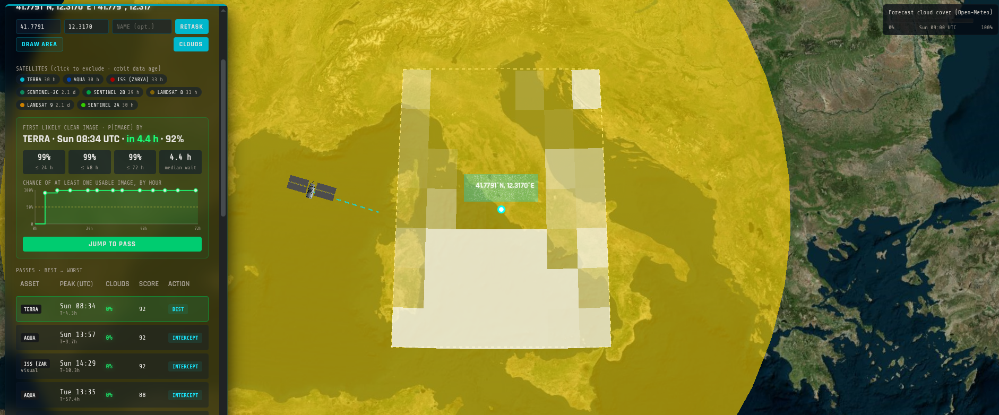

# ClearShot

**When is the soonest a satellite can take a clear photo of this place?**

Satellites fly fixed schedules, and most of their passes are wasted: clouds block the view,
or the target is in darkness. ClearShot combines orbit prediction, live cloud forecasts,
sunlight and a trained model to tell you which passes will actually produce a usable image —
and how soon to expect one.

Built at VT Hacks. Python + FastAPI backend, CesiumJS globe, no build step, no database.

---

> **TODO — screenshot 1 (hero).** The full app: globe with satellite orbits and their
> ground swaths, one swath highlighted gold over the target, dashboard panel on the left.
> Save as `docs/images/hero.png`.



## The problem

You need a satellite photo of a specific place: a flood, a wildfire, a port. Looking up
when a satellite flies over is easy — but flying over is not enough. About two-thirds of
Earth is under cloud at any moment, and optical sensors see nothing at night. Most "the
satellite is overhead" moments produce an unusable image.

ClearShot answers the operational question instead: **when do you actually get the
picture, and how much should you trust that?**

## What it does

- **Time-to-image, not a pass list.** The headline is one answer: the earliest pass likely
  to produce a usable image, plus the probability of getting one within 24, 48 and 72 hours.
- **Any point or area.** Click the globe, type coordinates, search a place name, or draw a
  polygon. Areas report what percentage of the region each pass actually images.
- **Honest probabilities.** A model trained on a year of real forecasts versus observed
  outcomes, validated on cities it never saw in training.
- **Explains itself.** Every pass says what limits it: `night`, `clouds`, `light`,
  `geometry` or `coverage`.
- **Degrades instead of failing.** No internet means cloud forecasts fall back to
  historical averages for that location, and the app keeps working.
- **Shows its own staleness.** A badge reports how old the orbit data is, because SGP4
  predictions drift after about a week.

> **TODO — screenshot 2 (the answer).** Close-up of the left panel: the green
> "First likely clear image" headline, the four probability boxes and the chart.
> Save as `docs/images/panel.png`.



> **TODO — screenshot 3 (area target).** An area drawn on the globe with the table showing
> per-pass coverage percentages. Save as `docs/images/area.png`.



> **TODO — screenshot 4 (cloud overlay).** The cloud overlay on, mid-timeline, with its
> dashed boundary and the legend visible. Save as `docs/images/clouds.png`.



## Quickstart

Requires **Python 3.11+** (developed on 3.12). Full from-scratch instructions, including
installing Python and troubleshooting, are in [docs/setup.md](docs/setup.md).

```bash
python3 -m venv .venv
.venv/bin/pip install -r requirements.txt
```

Add a free [Cesium ion](https://cesium.com/ion/signup) token to `config.js` in the project
root (gitignored), or the globe will not render:

```javascript
const CESIUM_TOKEN = 'paste-your-token-here';
```

Then run two terminals from the project root:

```bash
.venv/bin/uvicorn backend.main:app --port 8000   # the prediction API
python3 -m http.server 5500                      # the web page
```

Open **http://localhost:5500/frontend/index.html**.

## How it works

1. **Where the satellites are.** 8 Earth-observation satellites (Landsat 8/9,
   Sentinel-2A/B/C, Terra, Aqua, plus the ISS as a visual reference) are read from a cached
   Space-Track catalog on disk. The live Space-Track API is never called at request time.
2. **When they pass overhead.** SGP4 via Skyfield finds every rise/peak/set over the target
   in the next 72 hours, above 20° elevation.
3. **Whether the camera sees it.** A pass only counts if the sensor's ground swath covers
   the target — 185 km for Landsat, 290 km for Sentinel-2, 2,330 km for MODIS.
4. **Whether there is light and a clear sky.** Sun elevation gates the pass; hourly cloud
   forecasts come from Open-Meteo for that exact point.
5. **How much to trust the forecast.** The model converts forecast cloud and lead time into
   a calibrated probability of a usable image.
6. **How soon you get a picture.** Passes sharing the same sky are grouped so they count as
   one chance, then combined into the time-to-image answer.

Full detail, with file and line references, is in [TECH_AUDIT.md](TECH_AUDIT.md).

## API

```bash
.venv/bin/uvicorn backend.main:app --port 8000
```

| Endpoint | What it does | Speed |
| --- | --- | --- |
| `GET /api/passes` | Precomputed Blacksburg file, for instant page load; recomputed in memory once over an hour old | ~5 ms |
| `GET /api/calculate?lat=&lon=&name=` | Live computation for any point on the globe | ~2 s new point, ~0.2 s repeat |
| `GET /api/calculate?aoi=lat,lon;lat,lon;…` | Same, for an area (polygon) instead of a point | ~1–2 s |
| `…&sats=39084,49260` | Only these satellites (NORAD IDs) produce passes | |
| `GET /api/geocode?q=` | Place-name search, up to 5 matches | ~0.3 s |
| `GET /api/clouds?lat=&lon=` | Hourly forecast cloud cover on a 7×7 grid (1° cells) around a point, for the globe overlay | ~1.5 s, then cached 30 min |
| `GET /api/health` | Liveness, file age, pass count | |

A pass counts only if it is **above 20°**, the satellite's **sensor swath covers the point**,
and it happens in **daylight** — optical sensors need reflected sunlight. Each pass gets
three comparable probabilities of a usable image (observed cloud cover below 30%):

| Score | Meaning |
| --- | --- |
| `forecast_only` | Naive: `1 - forecast cloud %` |
| `climatology` | This location's historical clear-sky rate for the month |
| `model` | Trained model, zeroed in darkness |


### Optimizing for time-to-image

What an operator needs is **how soon they can get a usable image**, not a score for each pass.
Every target in the response carries an `acquisition` block that answers exactly that:

| Field | Meaning |
| --- | --- |
| `recommended_pass_id` | The **earliest** pass rated `good`; if none, the earliest pass within 5 points of the best score |
| `hours_to_recommended` | Wait until that pass peaks |
| `p_image_24h` / `p_image_48h` / `p_image_horizon` | Probability of at least one usable image by then |
| `median_hours_to_image` | When that probability first reaches 50% (`null` if never within 72 h) |
| `cumulative` | The curve behind those numbers, one point per weather window |

Each pass also gets `limited_by` (`night`, `clouds`, `light`, `geometry`, or `null` when
nothing is limiting it) and `imaging` (`false` for the ISS, which is excluded from the numbers above).

Passes close together see the same clouds, so they are not separate chances. Imaging passes
peaking within **3 hours** of each other form one weather window, which succeeds with its best
pass's probability. Windows are then treated as independent, so `p_image_*` is somewhat
optimistic when cloud patterns persist for days. `recommended_pass_id` and
`hours_to_recommended` do not depend on that assumption.

### Areas, satellite filter and orbit-data age

**Areas (AOI = area of interest).** Pass `aoi` as a polygon of 3–20 corners, at most 600 km
across. Beyond that, one cloud forecast at the centroid can't honestly speak for the whole
region. The backend spreads sample points inside the polygon and walks every satellite's
ground track: a pass is any stretch where the sensor swath touches at least one sample.
Each pass then reports `aoi_coverage_pct`, the share of the area it images. A pass imaging
**less than half** the area is at most `marginal` (`limited_by: "coverage"`) and doesn't
count toward time-to-image. A sliver of the area isn't the picture you asked for. Ground tracks
come straight from SGP4 with an Earth-rotation formula, not Skyfield's full conversion.
That keeps a 72 h area search at ~0.25 s, and positions within 0.7 km of Skyfield's.

**Satellite filter.** `sats` limits which satellites produce passes and the time-to-image
numbers. `satellites[]` in the response still lists all of them so the globe can draw them.

**Orbit-data age.** Every `satellites[]` entry carries `epoch_utc` and `tle_age_hours`, and
the document has `tle_age: {max_hours, min_hours, status}`. The status is `fresh` under
3 days, `stale` under 7 and `old` beyond that; SGP4 predictions drift by kilometers after
about a week. The age comes from the saved catalog; refresh it with `tools/spacetrack_gp.py`.

### How the model was trained and tested

One global model, not a grid of regional ones. The live Open-Meteo forecast is already
specific to the clicked point; what the model learns is how far to trust that forecast.

- **Data:** real cloud forecasts issued 0–3 days ahead (Open-Meteo Previous Runs API),
  paired with what was actually observed (ERA5 reanalysis), Sep 2025 – Aug 2026.
- **Training:** 520,396 daylight hours from 27 locations on every continent and ocean.
- **Testing:** 8 locations **never seen in training** — Blacksburg, Anchorage, Honolulu,
  Santiago, Johannesburg, Istanbul, Delhi, Sydney — chosen far from any training site.

Results on the unseen locations (128,880 daylight hours; Brier score, lower is better):

| Method | Brier | Log loss | Accuracy |
| --- | --- | --- | --- |
| **model** | **0.1245** | **0.399** | 82.7% |
| forecast_only (raw forecast) | 0.1480 | 0.637 | 79.4% |
| climatology | 0.2092 | 0.609 | 69.3% |
| "forecast < 30% = clear" rule | — | — | 82.8% |

What those numbers do and don't say:

- The model's probabilities are **16% better (Brier) than trusting the raw forecast**, and
  better at 7 of the 8 unseen locations. Istanbul is the exception.
- Its **yes/no accuracy is no better than the simple rule** "forecast under 30% means clear."
  The value is calibration. When the model says 50–60% it is clear 60% of the time, and
  60–70% means 70%; it is slightly cautious at the top (70–80% is actually clear 84% of
  the time). The raw forecast's 60–70% is clear only 36% of the time.
- **Brier Skill Score vs climatology:** model +0.405, raw forecast +0.292, persistence
  ("same as N days ago") −0.660.
- **Passes it calls good (score ≥ 0.70) are clear 90.5% of the time**, versus 79.7% for the
  raw forecast — half the false "good" calls, at the cost of flagging fewer passes.
- The shipped model scores exactly the same as the forecast calibrated per lead time
  (Brier Skill Score +0.405 for both): it is a calibration layer, not a better cloud predictor.
- **Adding location features did not help.** Local time, season, latitude and climatology
  were all tried; on unseen locations each made Brier equal or worse. With 27 training
  sites they learn site quirks that don't transfer, so the shipped model uses only the
  forecast and its lead time. Full table in `data/model_report.json`.
- "Observed" is ERA5 reanalysis — itself a model, not satellite cloud masks.

## Project layout

```
backend/     prediction API (FastAPI) — 12 modules, 2,174 lines
  main.py         endpoints
  passes.py       SGP4 passes, point and area
  weather.py      Open-Meteo: forecast, climatology, geocoding, cloud grid
  scoring.py      probabilities and verdicts
  acquisition.py  time-to-image
  aoi.py          area targets
  solar.py        sun elevation
  features.py     model features, shared by training and scoring
  catalog.py      reads the cached catalog, picks our satellites
  config.py       every tunable constant
  train_model.py  offline training
frontend/    the globe — one HTML file, CesiumJS + satellite.js
data/        cached catalog, trained model, generated results
tools/       Space-Track catalog fetcher
docs/        setup, Space-Track tool reference, screenshots
```

## Limitations

- **72-hour horizon.** Cloud forecasts stop being trustworthy past about 3 days, and the
  model was trained on lead times of 0–3 days.
- **You cannot task these satellites.** They fly fixed schedules; ClearShot tells you which
  of the passes you already get are worth using.
- **Probabilities assume weather windows are independent.** When cloud persists for days the
  combined odds read slightly optimistic. The recommended pass does not depend on that.
- **"Observed" cloud is ERA5 reanalysis**, itself a model, not satellite cloud masks.
- **Areas are capped at 600 km across**, because one cloud forecast at the centre cannot
  honestly speak for a larger region.

## Roadmap

- Commercial satellites that can be pointed, where the same scoring picks a window to buy.
- More weather inputs than cloud cover alone: ensemble spread, cloud layers, haze.
- Saved targets with alerts when a good window opens.
- Linking each past pass to the actual public image it produced.

## Data source & attribution

Orbital data in this repository comes from [Space-Track.org](https://www.space-track.org),
provided by United States Space Command (USSPACECOM) and the 18th Space Defense Squadron.

Cloud forecasts, the historical archive used for training, and place-name search
(geocoding, which uses GeoNames data) come from [Open-Meteo](https://open-meteo.com), free
for non-commercial use under CC BY 4.0.

`data/gp_catalog.json` and `data/sats.tle` are committed here as a point-in-time snapshot.
Redistribution is permitted under USSPACECOM's standing grant:

> USSPACECOM has provided express blanket approval for transfer/redistribution of basic
> SSA data and services accessed via www.Space-Track.org conditioned on appropriate
> citation.

That approval covers Two-Line Elements, Orbital Mean-Element Messages, SATCAT, and
decay/reentry data. The citation above is the condition being met; keep it with the data
if you redistribute it further, and cite Space-Track in any published analysis derived
from it.

Space-Track credentials, catalog refreshing and redistribution terms:
[docs/spacetrack-tool.md](docs/spacetrack-tool.md).
